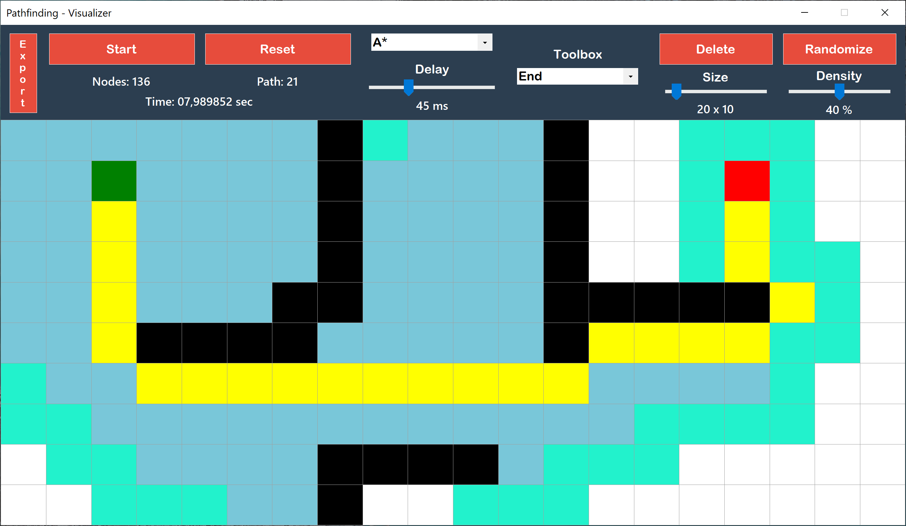
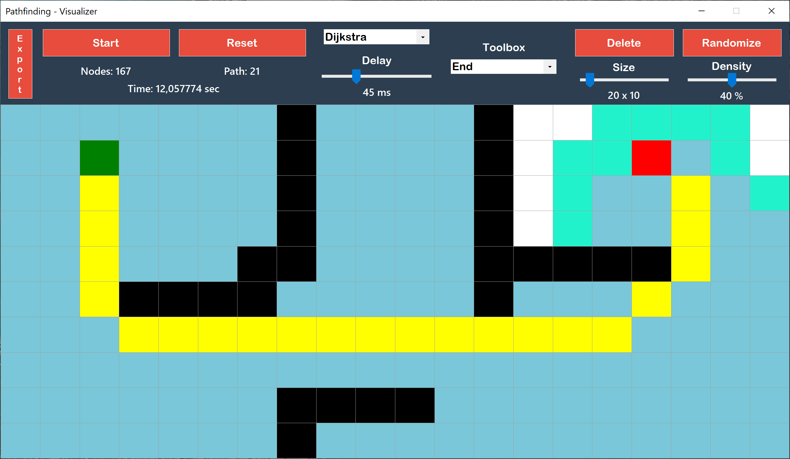
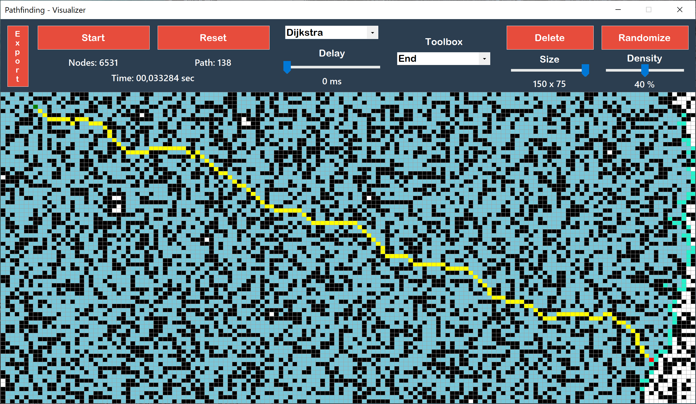
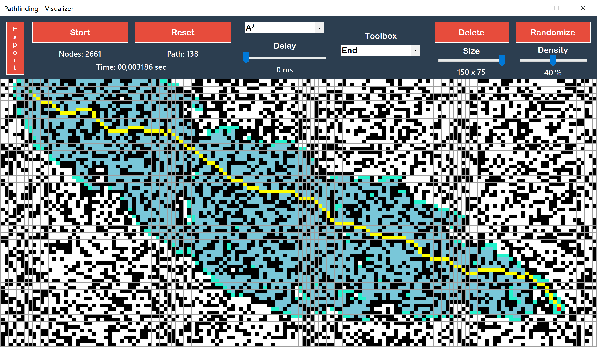
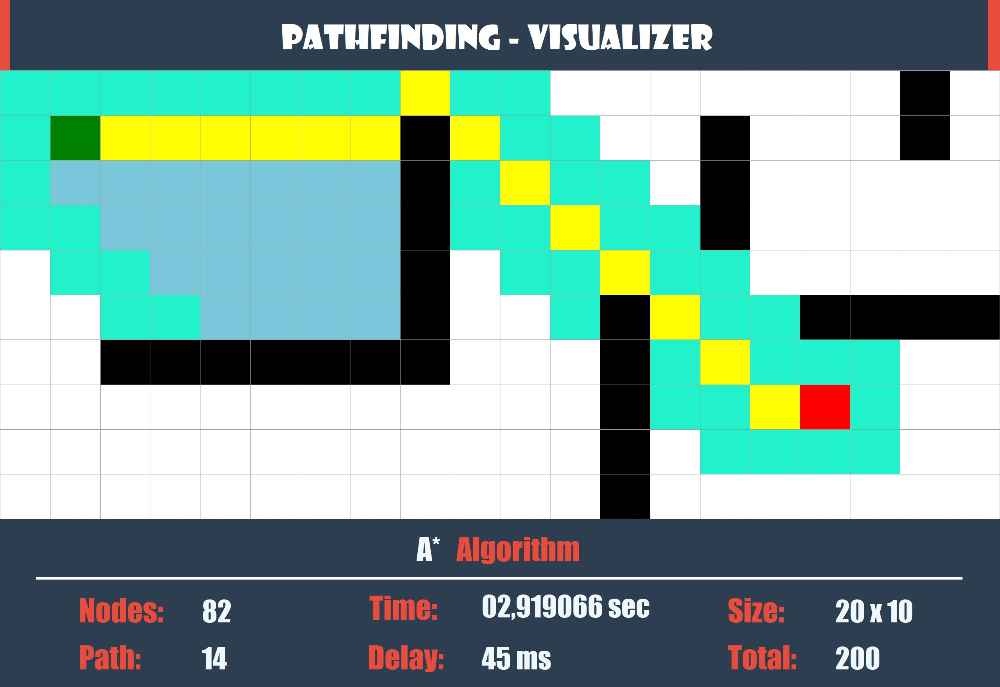

<h1 align="center">
  Pathfinding Visualizier
<br>
</h1>

<p align="center">
  
</p>

This is a pathfinding visualizer implemented in C# using the WinForms framework within Visual Studio. The application serves as an interactive tool for visualizing various pathfinding algorithms, allowing users to understand and observe how algorithms navigate through different mazes and obstacles.

# Screenshots

<div align="center" style="display: flex; justify-content: center; items-align:center; flex-wrap: wrap; gap: 2em">
  
  
  
  
  
</div >

# Features

- **Real-Time Visualization:** Watch the algorithms in action in real-time as they find the shortest path from the start to the destination.

- **Pathfinding Algorithms:**

  - **Dijkstra's Algorithm:** Visualize the renowned Dijkstra's Algorithm in action, exploring its efficiency in finding the shortest path.
  - **A-Star Search:** Watch the A\* Search algorithm intelligently navigate through mazes, showcasing its heuristic-driven approach for optimal pathfinding.

- **Customizable Mazes:** Create custom mazes with obstacles to test the adaptability and efficiency of pathfinding algorithms in different scenarios.

- **Customizable Parameters:**

  - **Delay Control:** Set the delay to observe the algorithms in real-time or speed up the visualization.
  - **Field Size:** Customize the size of the fields to simulate various grid dimensions.
  - **Density Configuration:** Adjust the density of obstacles to test algorithm adaptability.
  - **Randomization:** Randomize mazes for dynamic testing scenarios.

- **Image Export Functionality:** Capture and export visualizations with ease. Save images displaying the paths found by the algorithms along with relevant information.

# Setup

1.  **Clone the Repository:**

```bash
$ git clone https://github.com/kecioch/pathfinding-visualizer
```

2. **Open in Visual Studio:**
   Open the solution file (PathfindingVisualizer.sln) in Visual Studio.

3. **Build and Run:**
   Build the solution and run the application to start visualizing pathfinding algorithms.

# Technologies

- [C#](<https://www.wikipedia.org/wiki/C_Sharp_(programming_language)>)
- [Windows Forms](https://www.wikipedia.org/wiki/Windows_Forms)
